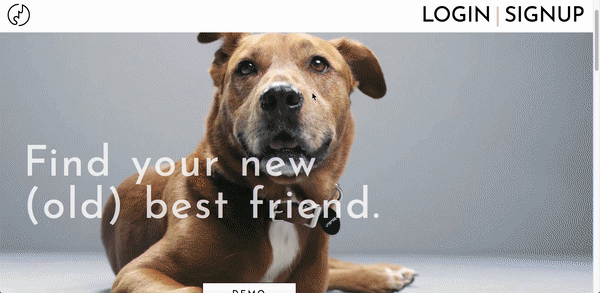
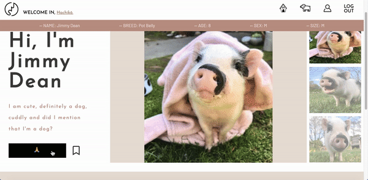
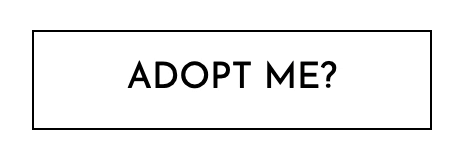

# README

Thank you for visiting Senior Pet Finder! Senior Pet Finder is inspired by Pet Finder, but only for pets over the age of 6. As a logged out user, you have the ability to view the full list of pets, as well as each pet's profile page. As a logged in user, you have the additional ability to adopt/unadopt pets, favorite/unfavorite pets, as well as view your lists of adopted and favorites pets. 


***
Technologies Used
-----------------

* Backend
    - PostgreSQL
    - Ruby on Rails
* Frontend
    - React.js
    - Redux
    - HTML5
    - CSS3
* Storage 
    - AWS
***
Features
--------
- ### User Authenication
   - Users can securely create an account and log in/out
        - User Auth created using BCrypt 
        - Certain actions/pages (i.e. adoption) only available through a protected route to ensure a user is logged-in
   - Log in modal prompted when attempting to adopt while logged out
   - Demo user log in available
  <p align="center">
      
  </p> 
  - ### Pets index page
   - Views clickable profile cards with limited information and an image for each pet
 - ### Pet show page
   - View multiple images for each pet
   - Adopt/unadopt pet
        - If a pet is adopted by a different user, the current user will not be able to adopt/unadopt
  <p align="center">
    
  </p>
   - Created a component "Display" to accommodate multiple images per pet and used it in the pet show page
  ```
  import React from 'react';

  class Mini extends React.Component {
    render() {
        return(
            <div className='photo-thumbnail'>
                {this.props.photos.map((photoUrl, i) => (
                     this.props.selectTab(i)}
                    className={this.props.selected === i ? "" : "not-selected-photo"}
                    />))}
            </div>
        )
    }
}

export default class Display extends React.Component {
    constructor(props) {
        super(props);
        this.state = {
            selectedPhoto: 0
        };
        this.selectTab = this.selectTab.bind(this);
    }

    selectTab(i) {
        this.setState({selectedPhoto: i});
    }

    render() {
        return(
            <div className='photo-main'>
                <div className='main-image-container'>
                    
                </div>
                <Mini
                    selected={this.state.selectedPhoto}
                    selectTab={this.selectTab}
                    photos={this.props.photoUrls}>
                </Mini>
            
            </div>
        )
    }
}
  - View information regarding the pet's shelter
    - Send a prefilled email to said shelter to request more information regarding (real life) adoption!
        
 - ### User show page
   - Current (logged-in) user can view their adopted pets and click each profile to navigate to the pet's show page. Feel free to favorite any pet, even if it's not your own!
   <p align="center">
      
  </p>

 - ### Additional styling features
   - Hoverable buttons to increase interactivity
   <p align="center">
      
      
  </p>

 - ### Future Considerations (coming soon!)
   - Filterable search
   - Browse by location (Google Maps API integration)

  
